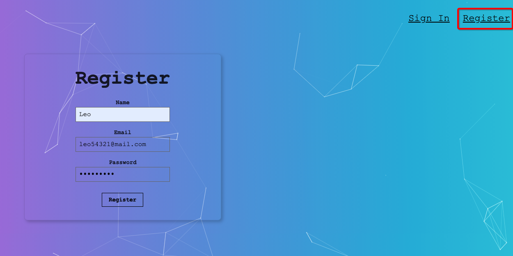
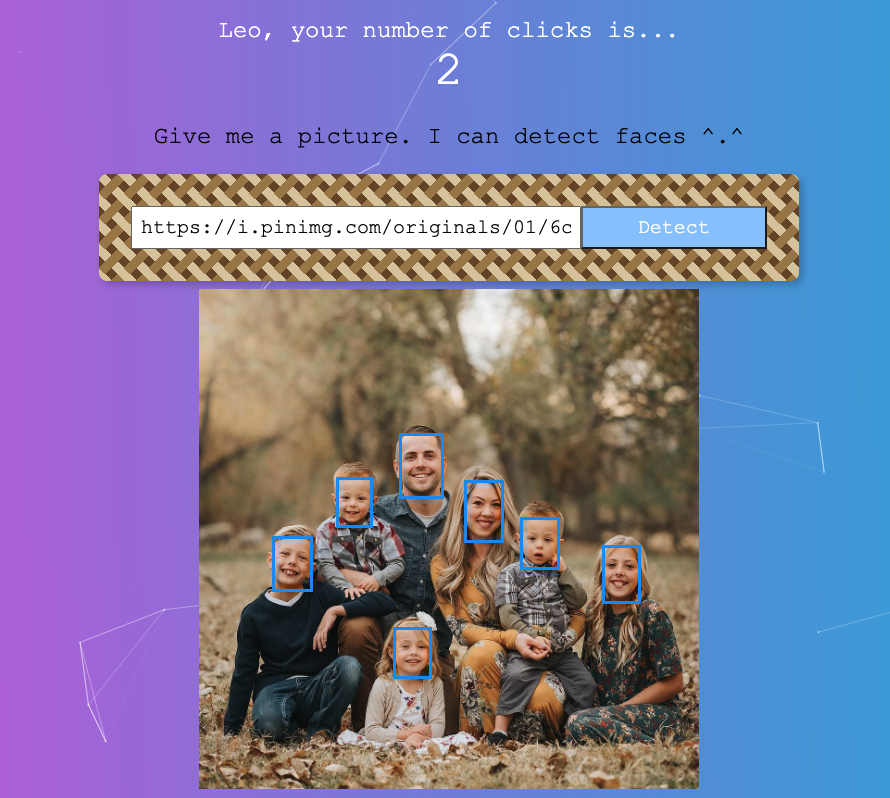

# <a role="link" target="_blank" rel="noopener noreferrer" href="https://people-face-detect.herokuapp.com/">face-detection-app</a>  
1. Register first (Then you can use your account to sign in next time.)   
  

2. Paste a picture URL with human face(s), then this app can do the face detection automatically.  
 

